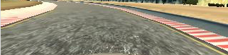
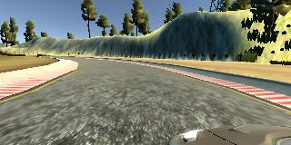
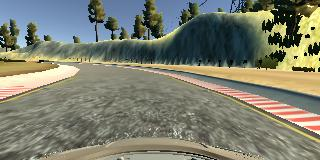
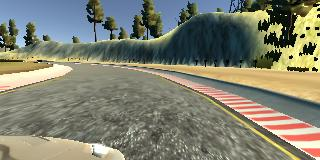
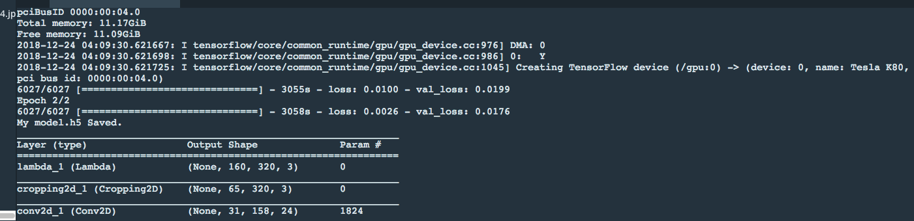

# **Behavioral Cloning**

## Writeup Template

### You can use this file as a template for your writeup if you want to submit it as a markdown file, but feel free to use some other method and submit a pdf if you prefer.

---

**Behavioral Cloning Project**

The goals / steps of this project are the following:
* Use the simulator to collect data of good driving behavior
* Build, a convolution neural network in Keras that predicts steering angles from images
* Train and validate the model with a training and validation set
* Test that the model successfully drives around track one without leaving the road
* Summarize the results with a written report


[//]: # (Image References)

[image1]: ./examples/placeholder.png "Model Visualization"
[image2]: ./examples/placeholder.png "Grayscaling"
[image3]: ./examples/placeholder_small.png "Recovery Image"
[image4]: ./examples/placeholder_small.png "Recovery Image"
[image5]: ./examples/placeholder_small.png "Recovery Image"
[image6]: ./examples/placeholder_small.png "Normal Image"
[image7]: ./examples/placeholder_small.png "Flipped Image"

## Rubric Points
### Here I will consider the [rubric points](https://review.udacity.com/#!/rubrics/432/view) individually and describe how I addressed each point in my implementation.

---
### Files Submitted & Code Quality

#### 1. Submission includes all required files and can be used to run the simulator in autonomous mode

My project includes the following files:
* model.py containing the script to create and train the model
* drive.py for driving the car in autonomous mode
* model.h5 containing a trained convolution neural network
* writeup_report.md or writeup_report.pdf summarizing the results

#### 2. Submission includes functional code
Using the Udacity provided simulator and my drive.py file, the car can be driven autonomously around the track by executing
```sh
python drive.py model.h5
```

#### 3. Submission code is usable and readable

The model.py file contains the code for training and saving the convolution neural network. The file shows the pipeline I used for training and validating the model, and it contains comments to explain how the code works.

### Model Architecture and Training Strategy

#### 1. An appropriate model architecture has been employed

Test NVIDIA's model from [here](https://images.nvidia.com/content/tegra/automotive/images/2016/solutions/pdf/end-to-end-dl-using-px.pdf).  This model will take in image of the shape (60,266,3) and dashboard images/training images are of size (160,320,3).


My model consists of a convolution neural network with 3x3 and 5x5 filter sizes and depths between 24 and 64 (model.py lines 78-101)

The model includes ELU layers to introduce nonlinearity with Exponential Linear Unit (code 78~101), and the data is normalized in the model using a Keras lambda layer (code line 80).

#### 2. Attempts to reduce overfitting in the model

The model contains dropout with 0.25 layer in order to reduce overfitting (model.py lines 96) and fewer epochs.

The model was trained and validated on the the dataset provided by Udacity (code line 7 and 37). The model was tested by running it through the simulator and ensuring that the vehicle could stay on the track.

#### 3. Model parameter tuning

The model used an rmsprop optimizer, so the learning rate was not tuned manually (model.py line 103).

#### 4. Appropriate training data

Training data was chosen to keep the vehicle driving on the road. I used a combination of center lane driving, recovering from the left and right sides of the road, then driving around the track clockwise to augment data set.

For details about how I created the training data, see the next section.

### Model Architecture and Training Strategy

#### 1. Solution Design Approach

The overall strategy for deriving a model architecture was described below,

My first step was to use a convolution neural network model similar to the one derived by Nvidia. I thought this model might be appropriate because it has a good number of layers and activations.

1. It splits image and steering angle data into a training and validation set (75% training, 25% validation). It got low mean squared error on the training set but appears high mean squared error on the validation set, i.e. overfitting on my model. So decrease epochs=2 to keep the validation loss low.
2. Then I made sure I had sample data for both good driving and recovery driving. I got recovery driving by getting recordings of the car going from the outside of the road to the center. I also created path-recovery data from the side cameras by applying a correction to the steering angle based on which side the camera data was taken from.
3. The final step was to run the simulator to see how well the car was driving around track one. There were a few spots where the vehicle fell off the track, especially right after the bridge. In order to fix this, I recorded a few more sample of me making that turn smoothly, and also made sure that I had data to recover if the car did not make the turn sharply enough (which was the issue I initially faced).

At the end of the process, the vehicle is able to drive autonomously around the track without leaving the road.

#### 2. Final Model Architecture

The final model architecture (model.py lines 79-102 represented by Keras API) consisted of a convolution neural network with the following layers and layer sizes. Little changes to the original NVIDIA architecture by advices from co-worker's suggestions and my exercise.

model.add(Lambda(lambda x: (x / 255.0) - 0.5, input_shape=(160,320,3)))<br>
model.add(Cropping2D(cropping=((70,25),(0,0))))<br>
model.add(Convolution2D(24,5,5,subsample=(2,2)))<br>
model.add(Activation('elu'))<br>
model.add(Convolution2D(36,5,5,subsample=(2,2)))<br>
model.add(Activation('elu'))<br>
model.add(Convolution2D(48,5,5,subsample=(2,2)))<br>
model.add(Activation('elu'))<br>
model.add(Convolution2D(64,3,3))<br>
model.add(Activation('elu'))<br>
model.add(Convolution2D(64,3,3))<br>
model.add(Activation('elu'))<br>
model.add(Flatten())<br>
model.add(Dense(100))<br>
model.add(Activation('elu'))<br>
model.add(Dropout(0.25))<br>
model.add(Dense(50))<br>
model.add(Activation('elu'))<br>
model.add(Dense(10))<br>
model.add(Activation('elu'))<br>
model.add(Dense(1))<br>

 Cropping

Layer (type)                 Output Shape              Param #
_________________________________________________________________
lambda_1 (Lambda)            (None, 160, 320, 3)       0
_________________________________________________________________
cropping2d_1 (Cropping2D)    (None, 65, 320, 3)        0
_________________________________________________________________
conv2d_1 (Conv2D)            (None, 31, 158, 24)       1824
_________________________________________________________________
activation_1 (Activation)    (None, 31, 158, 24)       0
_________________________________________________________________
conv2d_2 (Conv2D)            (None, 14, 77, 36)        21636
_________________________________________________________________
activation_2 (Activation)    (None, 14, 77, 36)        0
_________________________________________________________________
conv2d_3 (Conv2D)            (None, 5, 37, 48)         43248
_________________________________________________________________
activation_3 (Activation)    (None, 5, 37, 48)         0
_________________________________________________________________
conv2d_4 (Conv2D)            (None, 3, 35, 64)         27712
_________________________________________________________________
activation_4 (Activation)    (None, 3, 35, 64)         0
_________________________________________________________________
conv2d_5 (Conv2D)            (None, 1, 33, 64)         36928
_________________________________________________________________
activation_5 (Activation)    (None, 1, 33, 64)         0
_________________________________________________________________
flatten_1 (Flatten)          (None, 2112)              0
_________________________________________________________________
dense_1 (Dense)              (None, 100)               211300
_________________________________________________________________
activation_6 (Activation)    (None, 100)               0
_________________________________________________________________
dropout_1 (Dropout)          (None, 100)               0
_________________________________________________________________
dense_2 (Dense)              (None, 50)                5050
_________________________________________________________________
activation_7 (Activation)    (None, 50)                0
_________________________________________________________________
dense_3 (Dense)              (None, 10)                510
_________________________________________________________________
activation_8 (Activation)    (None, 10)                0
_________________________________________________________________
dense_4 (Dense)              (None, 1)                 11
_________________________________________________________________
Total params: 348,219
Trainable params: 348,219
Non-trainable params: 0
_________________________________________________________________

The first layer normalizes the data using a Lambda function. The second layer crops out the regions of the image that do not capture the road. This simplifies the images in order to not confuse the network. The next 5 layers are 2D convolutions, with increasing numbers of filters each layer (except the last 2, which are both 64 filters). The first 3 layers have 5x5 convolutions, and the last 2 layers have 3x3 convolutions. All 5 layers utilize the ELU activation function

#### 3. Creation of the Training Set & Training Process

For Dataset in ./data/ folder,
- Analyzed the Udacity Dataset and it contains laps with recovery data to keep moving forward.
- Split the dataset into training (75%) and validation set (25%) using sklearn preprocessing library.
- Use generator to generate the data without loading all the images and instead generate it at the runtime in batches of 64. Even Augmented images are generated inside the generators.

To augment the data sat, I also flipped images and angles thinking,
- Randomly shuffled the data set.
- Use OpenCV to convert to RGB for drive.py.
- For steering angle associated with three images, I use correction factor for left and right images with correction factor of 0.2: increase the steering angle by 0.2 for left image and for the right one  decrease the steering angle by 0.2.

 Left FOV<br>
 Center FOV<br>
 Right FOV

Then I repeated this process on track two in order to get more data points.



I used this training data for training the model. The validation set helped determine if the model was over or under fitting. The ideal number of epochs was 2 as evidenced by its low overfitting in validation set.  I used an rmsprop optimizer so that manually training the learning rate wasn't necessary.
